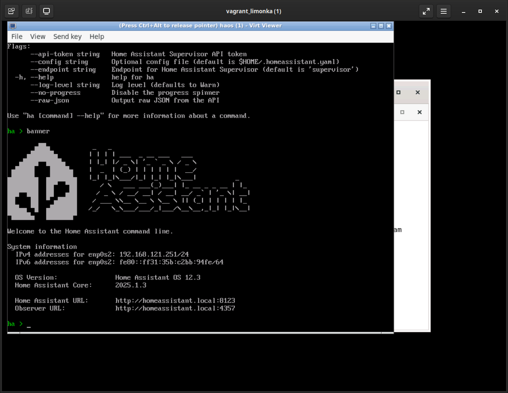
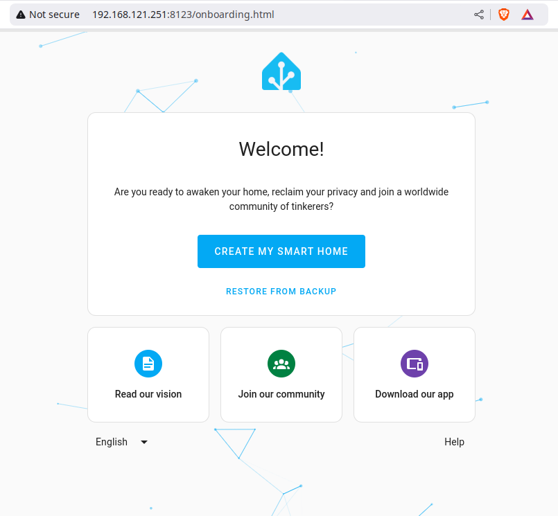

# Home Assistant Provisioning

This repository contains notes and hints on provisioning a
[Home Assistant](https://home-assistant.io) deployment.

## Provisioning a VM (libvirt/KVM)

### [Optional] Create a Home Assistant Network

A sample XML for a libvirt network definition is provided in
[homeasst0.xml](homeasst0.xml). To create a persistent network that is started
automatically on boot:

```bash
$ virsh net-define homeasst0.xml 
Network homeasst0 defined from homeasst0.xml
$ virsh net-autostart homeasst0
Network homeasst0 marked as autostarted
 $ virsh net-list
 Name              State    Autostart   Persistent
----------------------------------------------------
 homeasst0         active   yes         yes
```

### Download the `qcow2` image

Navigate to [this page](https://www.home-assistant.io/installation/linux) and
download the `KVM (.qcow2)` image.

After having downloaded and uncompressed (using `xz -d`) the
[qcow2 image](https://github.com/home-assistant/operating-system/releases/download/12.3/haos_ova-12.3.qcow2.xz)
the Home Assistant VM can be created using the command shown below.
However, before proceeding, make sure the image is readable to the `libvirt-qemu`
user.

```bash
$ sudo mv haos_ova-12.3.qcow2 /var/lib/libvirt/images/
```

### Create the VM using predefined network

In this example, `virt-install` is using the network defined above.

```bash
$ virt-install --name haos \
               --description "Home Assistant OS" \
               --os-variant=generic \
               --ram=4096 \
               --vcpus=2 \
               --disk /var/lib/libvirt/images/haos_ova-12.3.qcow2,bus=scsi \
               --controller type=scsi,model=virtio-scsi \
               --import \
               --graphics none \
               --network network=homeasst0,model=virtio \
               --boot uefi
```

### Create the VM using tun/tap (direct) network

`virt-install` allows VMs to "hook" into the host's physical interface using
tun/tap. to make use of this, `type=direct,source=<INTERFACE NAME>` should be
specified.

```bash
$ virt-install --name haos \
               --description "Home Assistant OS" \
               --os-variant=generic \
               --ram=4096 \
               --vcpus=2 \
               --disk /var/lib/libvirt/images/haos_ova-12.3.qcow2,bus=scsi \
               --controller type=scsi,model=virtio-scsi \
               --import \
               --graphics none \
               --network type=direct,source=enp1s0,source_mode=bridge,model=virtio \
               --boot uefi
```

### [Optional] Resize memory

Turns out the VM was using too much memory on a small dev laptop, so it got
downsized to 2G RAM:

```bash
$ virsh setmem haos 2048M --config
$ virsh setmaxmem haos 2048M --config
```

### Start the VM

Fire up the defined VM, if it's not yet running.

```bash
$ virsh start haos --console
```

Once started, the prompt will show 

```
Welcome to Home Assistant
homeassistant login: 
```

However, there are no users created, yet. Visit `<IP of VM>:8123` with your
browser and follow the prompts (as described in the [onboarding](https://www.home-assistant.io/getting-started/onboarding/) docs).


## Provisioning with Ansible

With the steps above done manually, the  underlying provisioning mechanism is
fairly clear. Putting it into an Ansible playbook and/or role can make
provisioning a homeassistant VM even more straightforward.

The main *meat* behind the logic included in this repository was **heavily**
influenced by [this RedHat blog post](https://www.redhat.com/en/blog/build-VM-fast-ansible).

In the post, the author uses a template definition of a `libvirt` VM to `define`
it. Initially, I'd thought that would not be necessary, but, based on my testing,
it appears that is the best way forward. The reasoning being:

When using `virt-install` with `--graphics none`, there is no console available
during startup. This, of couse, can be changed once the VM has been provisioned,
but can be an annoyance.

When using `virt-install` with `--graphics vnc`, the console is available at
startup, but causes the automation to "hang" because the task to create the VM
ends up waiting for user interactions.

The solution implemented in this repository gives the user a choice of either
using `virt-install` or a template file generated using
`virsh dumpxml <VM name> > <file>.xml` **after** the VM was provisioned with
`--graphics none` and template modified to allow connecting via `vnc` (default).
The template has also been modified to allow different attributes to be
configurable. To disable the use of the template and use `virt-install`, instead,
specify `-e "homeassistant_use_template=false"` when calling `ansible` or
`ansible-playbook`. Configurable attributes are (found in
[`defaults/main.yml`](roles/homeassistant/defaults/main.yml)):

- `homeassistant_vm_name` - Name of the VM (`haos`)
- `homeassistant_vm_ram_mb` - RAM to provision for the VM in MB (`4096`)
- `homeassistant_vm_vcpus` - Number of VCPUs to assign the VM (`2`)
- `homeassistant_image_dir` - Location where the VM image resides
 (`/var/lib/libvirt/images`)
- `homeassistant_version` - Version of image to use (`14.1`)
- `homeassistant_image_name` - Name of the image to use
 (`haos_ova-<homeassistant_version>.qcow2`)
- `homeassistant_vm_mac_addr` - Default MAC address for the VM (`52:54:00:fc:07:08`)
- `homeassistant_host_ifname` - Name of the host interface to bind to (`eth0`)
- `homeassistant_vm_tap_ifname` - Name of the VM tap interface to create (`macvtap1`)

In general, the things needing updates would be the RAM, VCPUs, version, customizing
the MAC address and making sure the host interface name corresponds to the actual
host ethernet interface name (most will end up looking like `ens1p0`). All other
values can be left at defaults.

### Setup

Make sure you have `ansible` installed - use your package manager (`dnf`/`apt`).
Once installed, clone this repository.

Also, make sure you have `libvirt` (and friends) installed:
- [Ubuntu](https://ubuntu.com/server/docs/libvirt)
- [Fedora](https://docs.fedoraproject.org/en-US/quick-docs/virtualization-getting-started/)

### Provisioning

This repository provides basic Ansible configuration, inventory and playbook to
provision homeassistant on the local machine (`localhost`).

You can verify that's the case by running the following command from within the
`ansible` directory:

```
$ ansible -i inventory.yml -m ping localhost
127.0.0.1 | SUCCESS => {
    "changed": false,
    "ping": "pong"
}
```

The `localhost.yml` playbook includes the `homeassistant` role where all the
magic happens. However, there is a failsafe in place where *nothing* will
happen unless tags are used. Here's a run without tags:

```
$ ansible-playbook -i inventory.yml localhost.yml

PLAY [Playbooks for localhost] ************************************************************************************************************************************************

TASK [Gathering Facts] ********************************************************************************************************************************************************
ok: [127.0.0.1]

TASK [Include all roles that apply to localhost] ******************************************************************************************************************************

PLAY RECAP ********************************************************************************************************************************************************************
127.0.0.1                  : ok=1    changed=0    unreachable=0    failed=0    skipped=0    rescued=0    ignored=0
```

There are three tags to be aware of:

- `download-homeassistant-image` - will only execute tasks associated with
 downloading the homeassistant image file.
- `provision-homeassistant` - will only execute tasks associated with provisioning
 the homeassistant VM.
- `setup-homeassistant` - will execute all the tasks included in the above tags.

So, the initial run would result in output that looks like the following:
**MAKE SURE TO RUN `sudo ls` BEFOREHAND**

<details>
  <summary>Click to expand large output</summary>

```
$ ansible-playbook -i inventory.yml localhost.yml -t setup-homeassistant                                                                                                 
                                                                                                                                                                               
PLAY [Playbooks for localhost] ************************************************************************************************************************************************
                                                                                                                                                                               
TASK [Gathering Facts] ********************************************************************************************************************************************************
ok: [127.0.0.1]                                                                                                                                                                
                                                                                                                                                                               
TASK [Include all roles that apply to localhost] ******************************************************************************************************************************
                                                                                                                                                                               
TASK [homeassistant : Set asset version and URL] ******************************************************************************************************************************
ok: [127.0.0.1 -> localhost]                                                                                                                                                   
                                                                                                                                                                               
TASK [homeassistant : Get specified version of homeassistant image] ***********************************************************************************************************
ok: [127.0.0.1 -> localhost]                                                                                                                                                   
                                                                                                                                                                               
TASK [homeassistant : Set name of image] **************************************************************************************************************************************
ok: [127.0.0.1 -> localhost]                                                                                                                                                   
                                                                                                                                                                               
TASK [homeassistant : Set name of asset] **************************************************************************************************************************************
ok: [127.0.0.1 -> localhost]                                                                                                                                                   
                                                                                                                                                                               
TASK [homeassistant : Check if image already exists] **************************************************************************************************************************
ok: [127.0.0.1 -> localhost]                                                                                                                                                   
                                                                                                                                                                               
TASK [homeassistant : Check if asset already exists] **************************************************************************************************************************
ok: [127.0.0.1 -> localhost]                                                                                                                                                   
                                                                                                                                                                               
TASK [homeassistant : Find browser download url] 

...snip...

TASK [homeassistant : Create assets directory] ********************************************************************************************************************************
skipping: [127.0.0.1]                                                                                                                                                          
                                                                                                                                                                               
TASK [homeassistant : Download the asset] *************************************************************************************************************************************
skipping: [127.0.0.1]                                                                  
                                                                                       
TASK [homeassistant : Decompress asset] ***************************************************************************************************************************************
skipping: [127.0.0.1]

TASK [homeassistant : Install lxml and provisioning tools] ********************************************************************************************************************
changed: [127.0.0.1]

TASK [homeassistant : Set host interface name] ********************************************************************************************************************************
ok: [127.0.0.1]

TASK [homeassistant : Get a list all VMs] *************************************************************************************************************************************
ok: [127.0.0.1]

TASK [homeassistant : Show all VMs] *******************************************************************************************************************************************
ok: [127.0.0.1] => {
    "all_vms": {
        "changed": false,
        "failed": false,
        "list_vms": [
            "vagrant_limonka"
        ]
    }
}

TASK [homeassistant : Copy over VM image] *************************************************************************************************************************************
changed: [127.0.0.1]

TASK [homeassistant : Create the VM with virt-install] ************************************************************************************************************************
skipping: [127.0.0.1]

TASK [homeassistant : Create the VM from template] ****************************************************************************************************************************
changed: [127.0.0.1]

TASK [homeassistant : Start the VM] *******************************************************************************************************************************************
changed: [127.0.0.1]

PLAY RECAP ********************************************************************************************************************************************************************
127.0.0.1                  : ok=14   changed=2    unreachable=0    failed=0    skipped=5    rescued=0    ignored=0
```

</details>


At this point, the VM should be running:

```
$ sudo virsh list --all
 Id   Name              State
---------------------------------
 1    vagrant_limonka   running
 36   haos              running
```

Connect `virt-viewer` to double-check the IP:

```
$ sudo virt-viewer haos
```



Use your web browser to connect to the `<IP>:8123` to finish configuring the VM.



### When Something Goes Wrong

If something should go wrong, you can always destroy/undefine the VM and start
from scratch (after fixing the problem that caused the failure):

```
$ sudo virsh destroy haos
$ sudo virsh undefine --nvram haos
Domain 'haos' has been undefined
```


## References and Links

### Home Assistant
- [Home Assistant OS VM Image Download](https://www.home-assistant.io/installation/alternative#download-the-appropriate-image)
- [Home Assistant Releases](https://github.com/home-assistant/operating-system/releases/)
- [Provisioning a Home Assistant VM](https://www.home-assistant.io/installation/alternative#create-the-virtual-machine)
- [Home Assistant Onboarding (setup)](https://www.home-assistant.io/getting-started/onboarding/)
- [Home Assistant Concepts and Terminology](https://www.home-assistant.io/getting-started/concepts-terminology/)
- [Reddit Post on Provisioning a HA KVM VM](https://www.reddit.com/r/homeassistant/comments/klx7b7/how_to_setup_hassos_on_a_kvm_virtual_machine/?rdt=57732)
- [Archived Reddit Post on Migrating HAOS](https://www.reddit.com/r/homeassistant/comments/ggmxzs/comment/fq3tx4i/)

### `libvirt`

- [Using `virt-install` with `direct` network option](https://gist.github.com/smurugap/163b3e2be7676a46c835339f8ba0710f)
- [Virtual NIC attachment modes](https://docs.redhat.com/en/documentation/red_hat_enterprise_linux/7/html/virtualization_deployment_and_administration_guide/sect-virtual_networking-directly_attaching_to_physical_interface#sect-Virtual_Networking-Directly_attaching_to_physical_interface)
- [How to use custom `tap` interface with `libvirt`](https://stackoverflow.com/questions/49476653/how-to-use-custom-tap-with-libvirt)

### Ansible

- [RedHat Blog on provisioning VM's with Ansible](https://www.redhat.com/en/blog/build-VM-fast-ansible)
